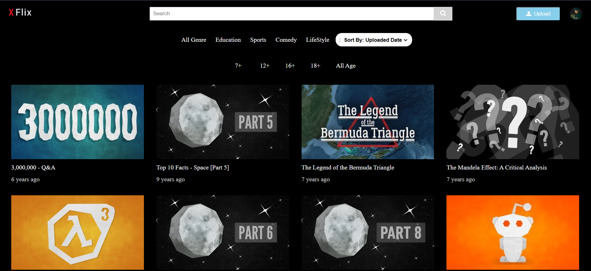
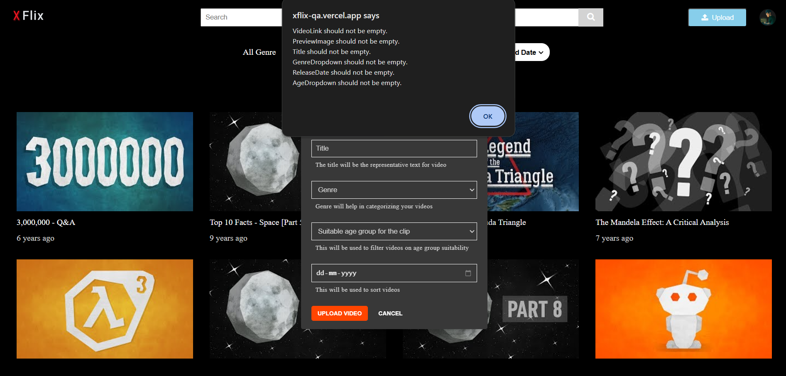

# 🎥 **Automating XFlix Video Sharing Platform**  

<p align="center">
  
  
  
  
  
  
</p>

## 🌟 **Project Overview**  
This project focuses on automating the testing process of the **XFlix** video-sharing platform, ensuring seamless functionality and persistent data integrity.  

Key functionalities include:  
- Verifying URLs and video upload features.  
- Testing search and filter functionalities.  
- Validating the like counter for uploaded videos.  

---

## 🚀 **Scope of Work**  
The following test cases were automated using **Selenium** and **Java**:  
1. ✅ Verify the **XFlix Homepage URL**.  
2. 🔍 Test the **Search Functionality**.  
3. 📊 Validate **Filters** for accurate results.  
4. ⬆️ Test the **Upload Video** feature.  
5. 👍 Check the **Like Counter** updates.  

---

## 🛠️ **Skills & Technologies Used**  
- **Selenium WebDriver** for web automation.  
- **Java** for writing robust test scripts.  
- **XPath** for locating web elements efficiently.  

---

## 📸 **Snapshots of the Work**  
### **Homepage Automation in Action**  
  

### **Video Upload Test**  
  

---

## 📚 **How to Run the Automation**  
1. Clone this repository:  
   ```bash
   git clone https://github.com/Gourab-Pal/QA-Xflix_automation.git
2. Install dependencies:  
    - **Selenium WebDriver**  
    - **ChromeDriver** (or your browser's driver)  

3. Run the test scripts using your favorite IDE or CLI.  

---

## 📜 **Learn More About XFlix**  

- [📘 XFlix Documentation](#) _([Xflix website](https://xflix-qa.vercel.app/))_  
- [🌐 Live Website](#) _([Xflix website](https://xflix-qa.vercel.app/))_  

---


